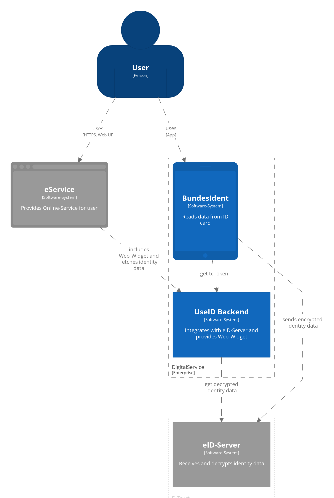
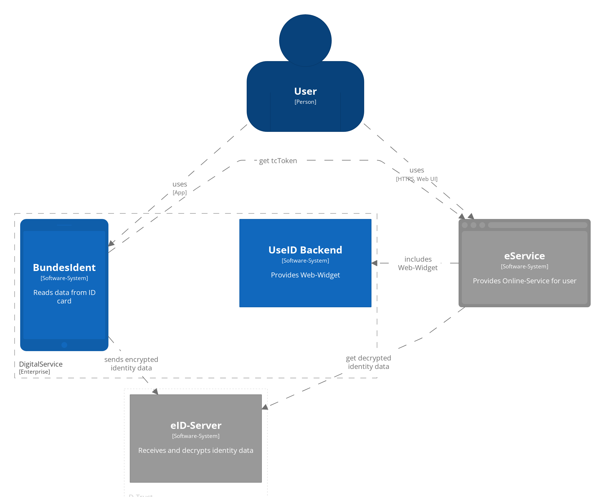
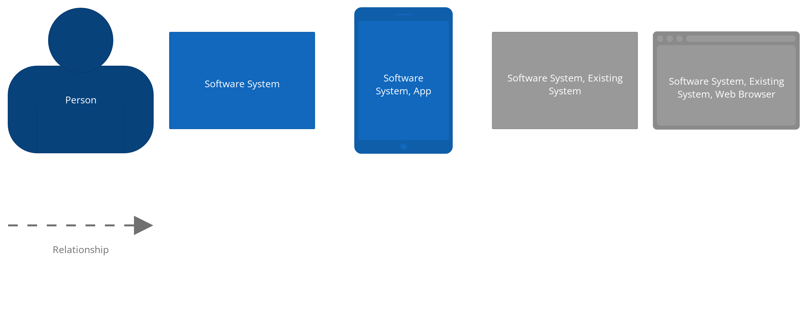

# Architecture diagrams

Diagrams as code using [Structurizr](https://structurizr.com)

## Working with the diagrams

### Live editor

https://structurizr.com/dsl

### View diagrams locally

See https://structurizr.com/help/lite

```
docker pull structurizr/lite
```

**Paula flow workspace**

```
docker run -it --rm -p 8080:8080 -v "$(pwd):/usr/local/structurizr" -e STRUCTURIZR_WORKSPACE_FILENAME=workspace-paula structurizr/lite
```

**Magnus flow workspace**

```
docker run -it --rm -p 8080:8080 -v "$(pwd):/usr/local/structurizr" -e STRUCTURIZR_WORKSPACE_FILENAME=workspace-magnus structurizr/lite
```

Open workspace in browser at http://localhost:8080

### Generate diagram exports

Exports of all diagrams as PNG are automatically generated by a [Github Actions workflow](../.github/workflows/generate-exports.yml), 
but you can manually generate them with this command:

```bash
npm i && npm run generate-images
```
## Rendered Diagrams

### Paula flow




### Magnus flow


