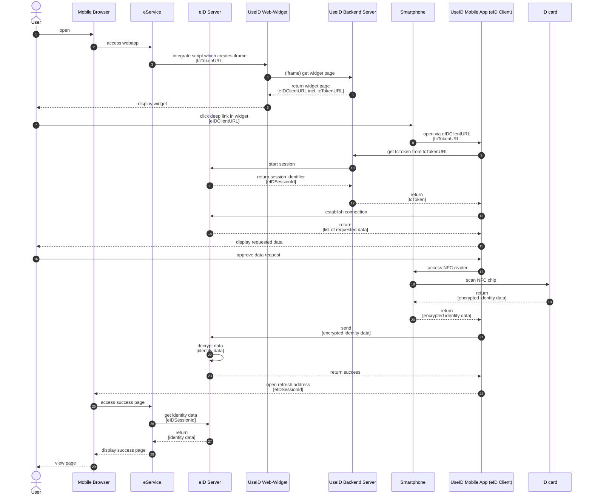

## Magnus flow (mobile only)

The following flow displays the "Magnus" eID flow. Magnus depicts the flow which applies for customers who already have an existing eID integration.
See [this confluence page](https://digitalservicebund.atlassian.net/wiki/spaces/UseID/pages/438829109/Components+and+Flows) for more information.

