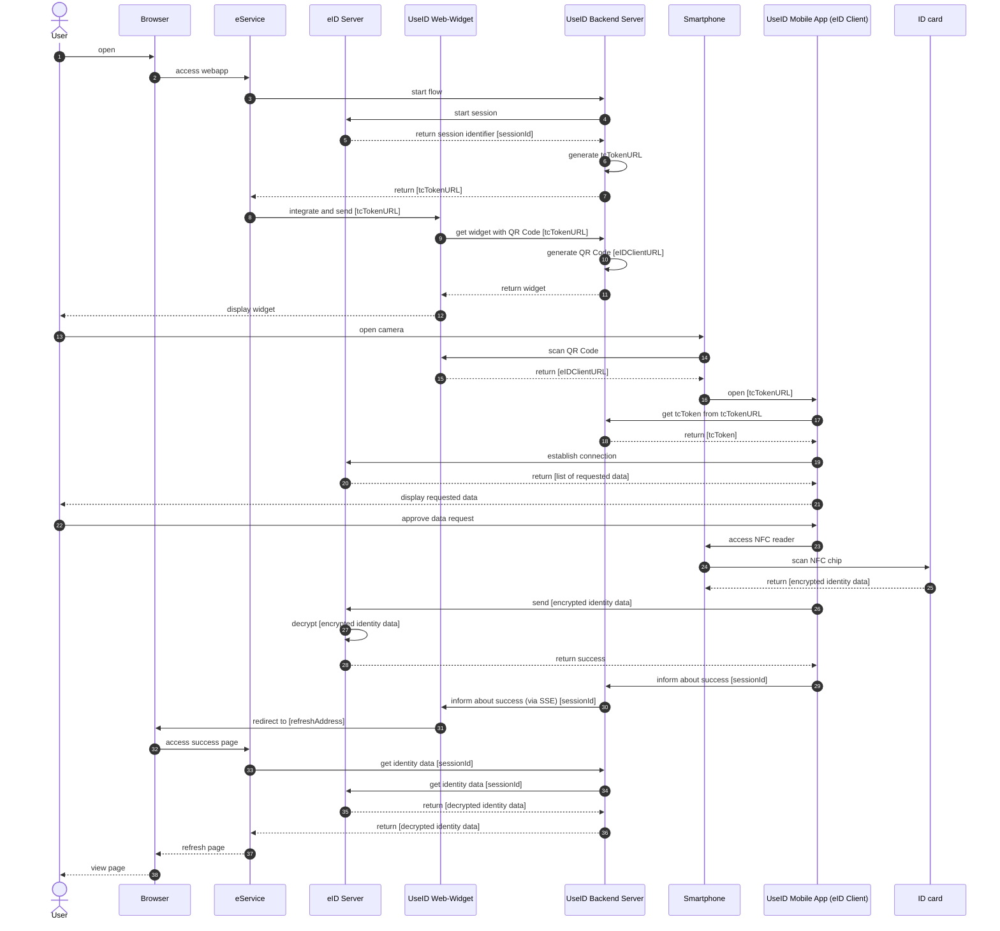

## Paula flow

The following flow displays the "Paula" eID flow. Paula depicts the flow for customers without eID integration using a simplified API provided by the Backend Server. 
See [this confluence page](https://digitalservicebund.atlassian.net/wiki/spaces/UseID/pages/438829109/Components+and+Flows) for more information.

