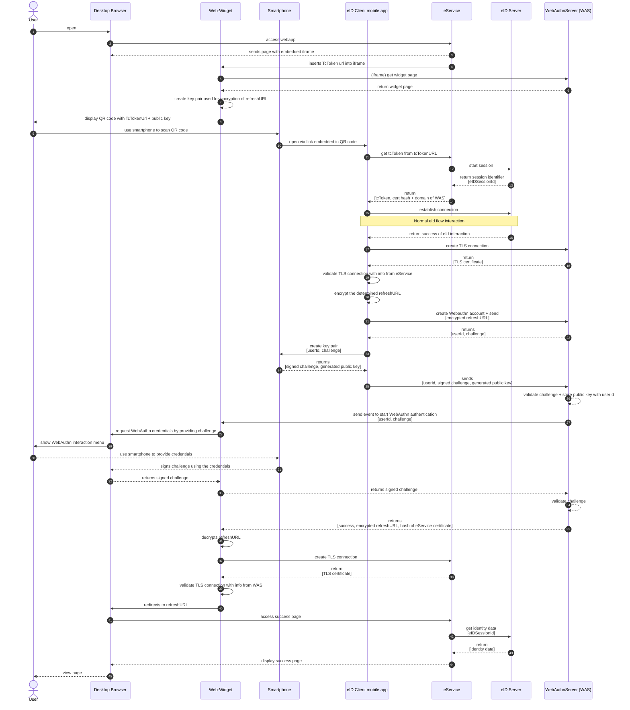

## Magnus flow (mobile only)

The following flow displays the eID flow using WebAuthn. The focus is on the usage of WebAuthn to ensure channel binding for the device switch. To generalize, it depicts the flow which applies to customers who already have an existing eID integration.
See [this confluence page]([https://digitalservicebund.atlassian.net/wiki/spaces/UseID/pages/438829109/Components+and+Flows](https://digitalservicebund.atlassian.net/wiki/spaces/UseID/pages/638615676/Secure+QR-Code+based+device+switch+with+WebAuthn)) for more information.

