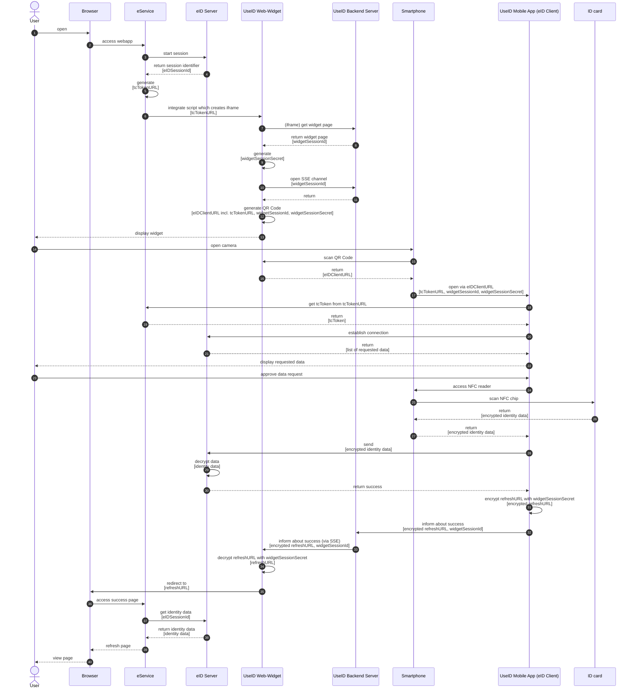

# Secure Device Switch 

## Goal

Many users still like to use their desktop computers to use governmental services. To identify with 
the BundesIdent app eID-Client they need to switch to the smartphone. The current solution requires the user to install a separate application on the desktop and pair their smartphone as a card reading device with the desktop app.
The following flow describes an adapted identification flow including a device switch with the goal to allow the user 
to use an eService on one device (e.g. a desktop computer) while executing the identification 
on another device (e.g. the smartphone) with the eID-Client only running on the second device. 
The flow makes use of a QR code to allow an easy transition between devices.

## Demo video
https://github.com/digitalservicebund/useid-architecture/assets/4391042/c9641c93-9571-4ec4-a99d-8fd4e30fc6ee

## Overview

* The following section describes the desired QR-Code based flow.
* The [problem statement](problem-statement.md) lays out the problems with the desired solution bye means of a phishing attack scenario.
* The [evaluation of approaches](evaluation-of-approaches.md) shows an overview of all considered mitigation strategies
for the phishing attack vector.
* The [proposal](proposal-qr-code-based-device-switch-with-webauthn.md) describes a possible solution approach 
which makes use of WebAuthn to ensure a secure switch between devices.

## Flow

### Description

* The user starts an identification process with some eService on their desktop computer
* The eService shows a BundesIdent web widget which displays a QR code
  * The QR code encodes the `eID-Client URL` including the `tcTokenUrl` and a `widgetSessionId` which is unique to this very instance of the web widget
* The user scans the QR Code with their smartphone which opens the eID-Client on the smartphone
* The eID-Client fetches the `tcToken` with the `tcTokenUrl` from the QR Code
* The user identifies with scanning their ID card
* The eID-Client sends the user’s identity data to the eID-Server
* The eID-Client sends a success message to the UseID backend service along with the `widgetSessionId`
* The UseID backend identifies the web widget instance of the user using the `widgetSessionId` and propagates the success message to it 
(via [Server-Sent Events](https://www.w3.org/TR/2021/SPSD-eventsource-20210128/), [Long Polling](https://www.rfc-editor.org/rfc/rfc6202#section-2), [WebSocket](https://www.rfc-editor.org/rfc/rfc6455) or similar means).
* The widget redirects the users browser on the desktop computer to the `refreshAddress` of the eService
* The eService fetches the identity data of the user from the eID-Server
* The user is now identified against the eService running in the browser on the desktop computer 

### Sequence diagram

