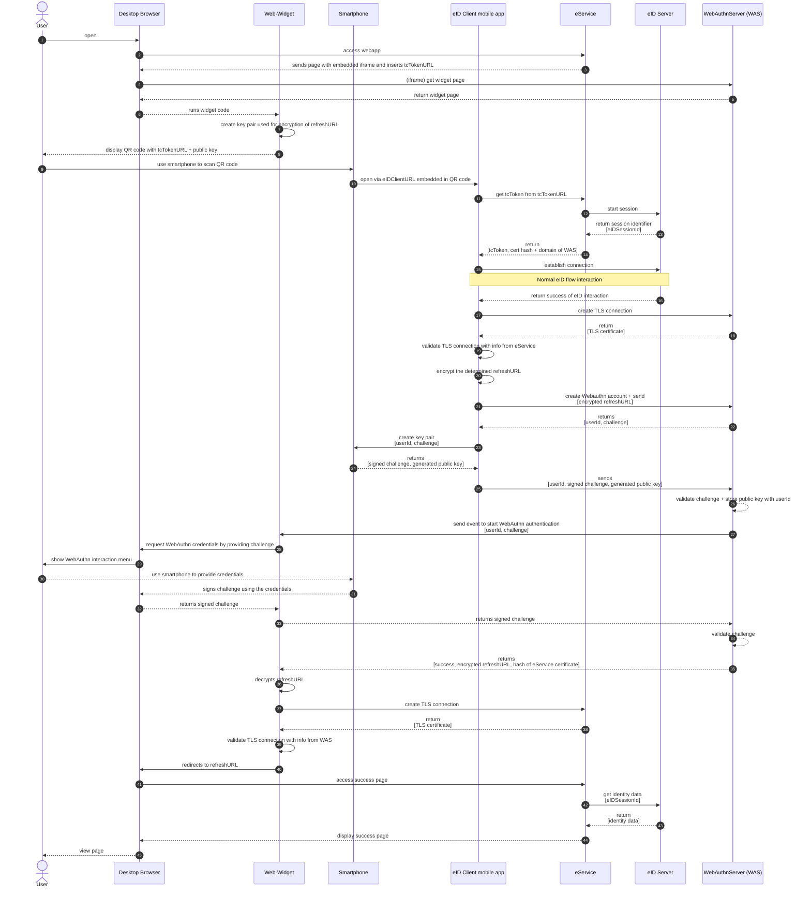

# Introduction

This is a proposal for an adapted eID flow including a device switch with the goal to allow the user to use an eService on one device while executing the Online-Authentication on another device with the eID-Client only running on the second device. The flow makes use of a QR code to allow an easy transition between devices. The device switch is secured using WebAuthn.

# Components

We have the following components:

-   eService
-   WebAuthn-Server 
-   eID-Server
-   Web-Widget

The eService and eID-Server follow the definitions for the eID-Flow. The Web-Widget is an iframe embedded in the eService’s page shown to the user. It is used to handle the WebAuthn flow on the desktop and to show the QR code which enables the device switch.

In the following, the “WebAuthn-Server” is the component responsible for storing the WebAuthn credentials and implement the WebAuthn specification, provide a Web-Widget for eServices and keep a connection to all instances of the Web-Widget to allow server to client messaging. 

# Goals

The solution described in this document pursues the goal of allowing users to use an eService on one device (e.g. a desktop computer without NFC) while executing the Online-Authentication on another device (e.g. a mobile device with NFC) with the eID-Client only running on the second device. No eID-Client software needs to be installed on the desktop computer. To make this device switch possible, a QR-Code is displayed to the users which is scanned with the mobile device and calls the eID-Client interface. However, without further measures no binding between the communication on the mobile device and the communication on the desktop exists. This could be used by attackers e.g. through a phishing attack. Therefore, the flow should ensure the following:

-   **SG-1:** Bind channel from mobile device to eService to the channel from desktop to eService.
    
-   **SG-2:** The channels eID-Client to eService and eID-Client to eID-Server should be bound.
    
-   **SG-3:** Ensure authenticity of a trusted channel from eID-Client to WebAuthn-Server, eService and eID-Server.
    
-   **SG-4:** Ensure authenticity of a trusted channel from browser to WebAuthn-Server and eService.
    
-   **SG-5:** Only the clients running on the user’s mobile device or desktop and the eID-Server should know the refreshURL with which the identity data can be accessed.
    
-   **SG-6:** Only a legit eServices can embed the Web-Widget into their client page to prevent phishing websites to display it. 
    
-   **FG-1:** The flow should be agnostic of specific providers for the different components.
    

# Measures

To reach the goals the following measures are taken:

-   **M-1:** The mobile device creates a temporary account with the WebAuthn-Server using WebAuthn. The WebAuthn-Server authenticates the connection to the Web-Widget on the desktop using the very same account. This binds those two channels. The measurements of WebAuthn are used to secure this binding. 
    
-   **M-2:** The eID-Client sends the refreshURL to the WebAuthn-Server when creating the temporary account. The WebAuthn-Server only shares it with the Web-Widget after successfully authenticating the connection.
    
-   **M-3:** Using the known eID flow the channels eID-Client to eService and eID-Client to eID-Server are bound. The authenticity of eService and eID-Server are ensured using the _Berechtigungszertifikat_ handed out by the eID-Server to the eID-Client.
    
-   **M-4:** The eService sends a hash of the TLS certificate and the domain of the WebAuthn-Server to the eID-Client. As the eService can be trusted because of **M-3** this information can be trusted. Before connecting with the WebAuthn-Server, the eID-Client validates the TLS connection by checking the returned certificate against the certificate hash and ensuring that the domain follows a same-origin policy with the domain received from the eService. 
    
-   **M-5:** The refreshURL is encrypted by the eID-Client before it is shared with the WebAuthn-Server. Only the widget can decrypt it.
    
-   **M-6:** The WebAuthn-Server sends a hash of the TLS certificate and the domain of the eService to the Web-Widget. The Web-Widget opens a new TLS connection to the eService and validates the TLS connection by checking the returned certificate against the certificate hash and ensuring that the domain follows a same-origin policy with the domain received from the WebAuthn-Server.  
    As only a trusted WebAuthn-Server (**M-4**) will have the correct refreshURL this info can be trusted.
    
-   **M-7:** The eService provides the address of the WebAuthn server to the eID-Client to allow the eID-Client to call the correct endpoint for starting the WebAuthn-Flow. This allows the eID-Client to work with different WebAuthn-Servers.
    
-   **M-8:** Only domains registered with the WebAuthn-Server are allowed to embed the Web-Widget in an iframe.
    

These measures help to reach the security goals
| **Goals** | **Measures**           | **Notes**                                                                                                                                                                                                                                                                                                |
|-----------|------------------------|----------------------------------------------------------------------------------------------------------------------------------------------------------------------------------------------------------------------------------------------------------------------------------------------------------|
| **SG-1**  | **M-1, M-2, M-4, M-6** | **M-1** binds the connection to the WebAuthn-Server. As **M-4** and **M-6** bind the WebAuthn-Server’s connection to the eID-Client or Desktop to the respective connections to the e-Service the e-Service’s connections are bound, too.                                                                |
| **SG-2**  | **M-3**                |                                                                                                                                                                                                                                                                                                          |
| **SG-3**  | **M-3, M-4**           |                                                                                                                                                                                                                                                                                                          |
| **SG-4**  | **M-6, M-4**           | The authenticity of the WebAuthn-Server is not directly checked by the Web-Widget. However, even with a Session-Breaking Proxy WebAuthn ensures that no replay attacks are possible. Therefore, the WebAuthn-Server can ensure that a successful connection to the Web-Widget and the eID-Client exists. |
| **SG-5**  | **M-5**                |                                                                                                                                                                                                                                                                                                          |
| **SG-6**  | **M-8**                |                                                                                                                                                                                                                                                                                                          |
| **FG-1**  | **M-7**                | The other components besides the WebAuthn-Server can be provided by different providers as the needed information is provided similar to the eID flow.                                                                                                                                                   |

# Description of the flow

## Prerequisite: Registration of eService with WebAuthn-Server 

-   The eService sends it’s domain and TLS server certificates to the WebAuthn-Server over a secure channel (similar to the registration with the eService certificate aka. Berechtigungszertifikat).
-   The WebAuthn-Server stores the eService domain and a hash of the TLS server certificate.
-   The eService receives the TLS server certificate of the WebAuthn-Server and stores a hash of it together with the server address.
-   The eService includes the WebAuthn-Server address and the hash of the TLS server certificate in the TC Token. 

## Flow in detail

1.  The user accesses the eService via a user-agent (hereinafter “browser”) on their desktop device.
2.  The eService-Client (the frontend running in the user’s browser) embeds a Web-Widget from the WebAuthn-Server via iframe handing in the TC Token URL.
    1.  _Note: only domains registered with the WebAuthn-Server (see_ [_Prerequisite_](#)_) are allowed to embed the Web-Widget in an iframe (secured by the_ [_frame-ancestors directive of the Content-Security-Policy_](https://developer.mozilla.org/en-US/docs/Web/HTTP/Headers/Content-Security-Policy/frame-ancestors)_)_
3.  The Web-Widget generates a public / private key pair.
    -   _Note: The public key will be used by the eID-Client to encrypt the refreshURL so that only this specific instance of the Web-Widget can decrypt it. An attacker without the private key would not be able to read the refreshURL even if eavesdropping the communication to the eService server or getting in possession of it by other means._
4.  The Web-Widget displays the QR-Code including the eID-Client URL and the public key to the user.
5.  The user scans the QR-Code using their mobile device to receive the eID-Client URL.
6.  The mobile device calls the eID-Client URL which opens the eID-Client.
7.  The eID-Client performs the Online-Authentication as described in TR-03124-1 section 2.7.
    1.  Additionally to the checks described in TR-03124-1 section 2.7.3, the eID-Client connects to the WebAuthn-Server address included in the TC Token and validates the hash of the TLS server certificate against the one from the TC Token / eService certificate (depending on the option from [Prerequisite](#)). 
8.  The eID-Client uses the public key to encrypt the determined valid refreshURL. 
9.  Before returning to the caller, the eID-Client starts a [WebAuthn registration](https://developer.mozilla.org/en-US/docs/Web/API/Web_Authentication_API#registration)
    1.  The eID-Client calls the WebAuthn-Server at the address included in the TC Token (see [Prerequisite](#)) to create a new temporary user sending along the encrypted refreshURL. 
    2.  The WebAuthn-Server responds with a userId and a WebAuthn challenge.
    3.  A public / private key pair is created and stored on the mobile device (or in the user’s iCloud keychain on iOS as described [in the appendix](https://digitalservicebund.atlassian.net/wiki/spaces/UseID/pages/638713899/Whitepaper+Compliance+of+QR-Code+based+device+switch+with+TR-03124-1+eID-Client#)).
    4.  The eID-Client uses the generated private key to sign the received challenge.
    5.  The eID-Client sends the userId, the signed challenge and the generated public key to the WebAuthn-Server.
    6.  The WebAuthn-Server validates the signed challenge using the public key to complete the registration in case of a valid challenge.
10.  After a successful registration the WebAuthn-Server starts a [WebAuthn authentication](https://developer.mozilla.org/en-US/docs/Web/API/Web_Authentication_API#authentication) and sends the userId and a new WebAuthn challenge to the Web-Widget of the user (via [Server-Sent Events](https://www.w3.org/TR/2021/SPSD-eventsource-20210128/), [Long Polling](https://www.rfc-editor.org/rfc/rfc6202#section-2), [WebSocket](https://www.rfc-editor.org/rfc/rfc6455) or similar means).   
	1.  The user’s browser handles the WebAuth authentication by communicating with the mobile device.
		-  _Note: The WebAuthn authentication uses the biometric data of the user to protect the private key and includes a proximity check to ensure the devices are in the same network and location (see how that differs for Apple devices connected to the iCloud in the_ [_appendix_](https://digitalservicebund.atlassian.net/wiki/spaces/UseID/pages/638713899/Whitepaper+Compliance+of+QR-Code+based+device+switch+with+TR-03124-1+eID-Client#icloud)_)._
	2. The browser provides the signed challenge to the Web-Widget.
	3.  The Web-Widget sends the userId and the signed challenge to the WebAuthn-Server.
	4. The WebAuthn-Server validates the signed challenge with the public key of the user to complete the authentication in case of a valid challenge.
11.  The WebAuthn-Server sends the encrypted refreshURL and the hash of the eService TLS server certificate (see [Prerequisite](#)) as the response of the successful WebAuthn authentication to the Web-Widget.
12.  The Web-Widget decrypts the encrypted refreshURL.
13.  The Web-Widget validates if the domain of the refreshURL is the same as the domain of the eService and validates the hash of the eService TLS server certificate against the one received from the WebAuthn-Server.
	1.  _Note: This could be done by connecting to the eService directly from the Web-Widget (e.g. using_ [_forge_](https://github.com/digitalbazaar/forge)_)_
14.  The Web-Widget does one of the following.
	1. It sends the refreshURL to the eService-Client embedding the iframe (e.g. via [Channel Messaging API](https://developer.mozilla.org/en-US/docs/Web/API/Channel_Messaging_API)) which directs the browser to it.
	2. It directs the browser to the refreshURL.
		1. _Note: The iframe which embeds the Web-Widget needs proper permissions to redirect the browser (see_ [_sandbox allow-top-navigation_](https://developer.mozilla.org/en-US/docs/Web/HTML/Element/iframe#sandbox)_)_
15.  The eService-Server fetches the identity data from the eID-Server.

## Sequence diagram

